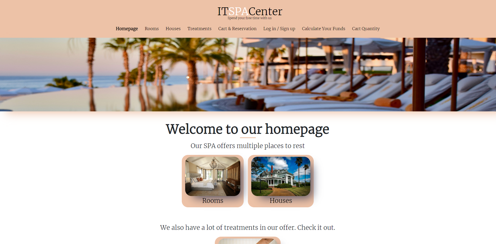

## IT SPA - ALK Studies Project

The project is a SPA Center dedicated to programmers written as a Single Page Application using Vanilla Javascript and Node.JS as a primary technologies (styled with SCSS/CSS3).

### Using this application you can:

- viewing the available treatments
- viewing the available rooms and houses
- adding treatments to the cart
- adding rooms, houses to the cart
- choosing check-in and check-out date
    - check-in date must be today date or later
    - check-out date must be maximum 1 year from today
- User registering
    - checking password length
    - checking if inputs are filled
    - checking registered users (used logins)
    - show/hide your password
- Calculating your funds
    - handling dot error
- Assuming your order
    - checking if all required inputs are filled

### How to install?

If you wanna install this app for own, do following steps:
1. Use `git clone https://github.com/goldipl/SPA_shop_application.git` in your IDE (I'm programming in Visual Studio Code because I think it's the best option) using local folder on your computer
2. Open terminal and type `npm run install` to install all dependencies (*important* - you must have [npm](https://docs.npmjs.com/downloading-and-installing-node-js-and-npm) and [NodeJS](https://nodejs.org/en/) installed)  
3. Change fetching paths in following js files from github to local version (there are commented code lines):
    - Rooms.js -> use line `22` instead `20`   
    - Treatments.js -> use line `24` instead `22`   
    - HouseDetails.js -> use line `11` instead `13`  
    - RoomDetails.js -> use line `11` instead `13`   
4. Enter all commands typed below
    - `npm run start:db`  
    - `npm run start:app`  
    - and open http://localhost:1234  

### Available Scripts

In the project directory, you can run following scripts:   
`npm run start:db` - runs and load database    
`npm run build` - builds the app for production   
`npm run start:app` - runs the app in the development mode. Open http://localhost:1234 to view it in your browser. The page will reload when you make changes.

### Used Technologies

* HTML
* Bootstrap
* CSS, Sass
* JavaScript
* Node, Express

### Used Environment

* [Netlify](https://www.netlify.com/)  
* [my-json-server](https://my-json-server.typicode.com)

### Screenshots
* desktop version screenshot  

  
* mobile version screenshot  

 